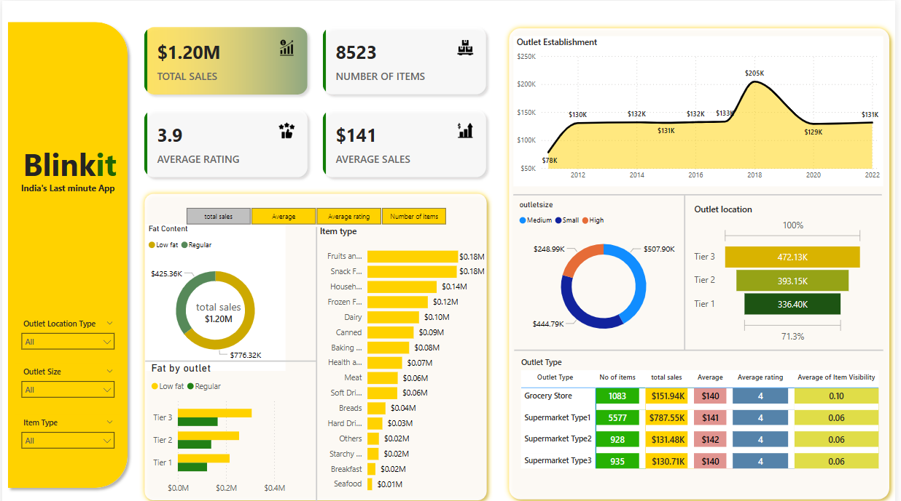

# Blinkit Power BI Dashboard

This project presents a **Power BI dashboard** created using Blinkit (India's Last-Minute App) dataset. The dashboard provides insights into sales performance, item distribution, outlet performance, and average ratings.

## 📊 Key Insights

- **Total Sales**: $1.20M
- **Number of Items**: 8523
- **Average Rating**: 3.9
- **Average Sales per Item**: $141

## 🔍 Dashboard Features

- Sales breakdown by **Item Type**, **Outlet Type**, and **Outlet Size**
- Trend of **Outlet Establishments** over years
- Fat content-based sales analysis
- Tier-wise outlet performance
- Interactive filters for deeper analysis

## 🛠 Tech Stack

- Power BI (Data Visualization)
- Excel (Data Source)

## 📁 Project Structure

```
blinkit-powerbi-dashboard/
├── assets/
│   └── dashboard_screenshot.png
├── data/
│   └── blinkit_dataset.xlsx
├── Blinkit Dashboard.pbix
└── README.md
```

## 📸 Preview



## 📦 How to Use

1. Clone the repository.
2. Open `Blinkit Dashboard.pbix` in Power BI Desktop.
3. Connect to the dataset in `data/blinkit_dataset.xlsx` if needed.
4. Explore the dashboard with filters and visualizations.

---

## 📬 Contact

For any queries or suggestions, feel free to reach out!
